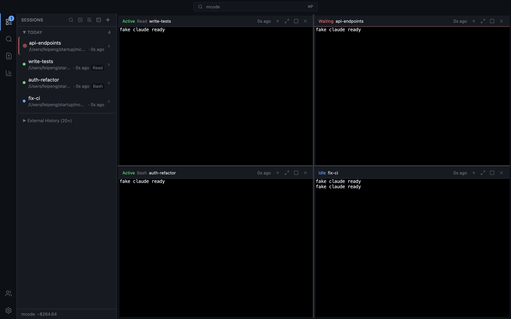
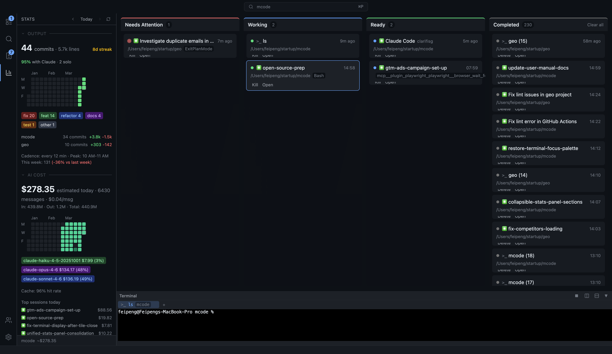
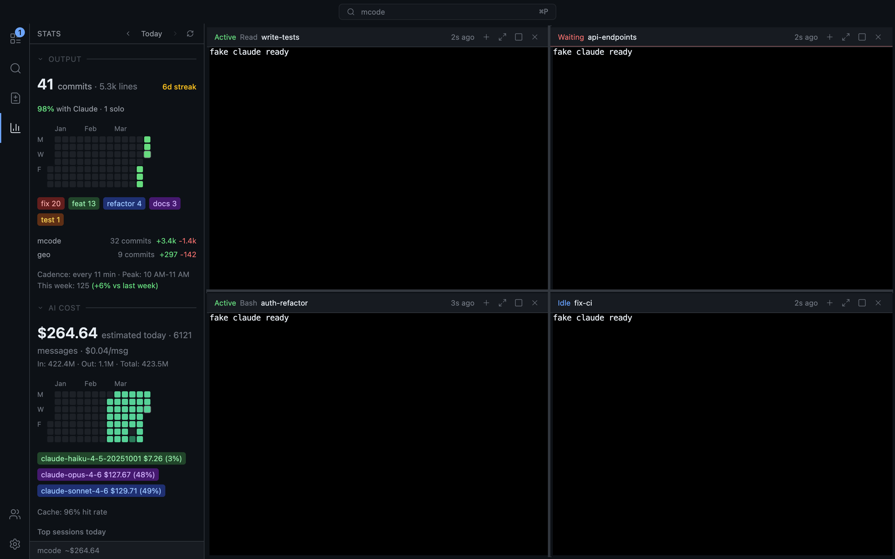

# mcode

**Terminal-native tiling IDE for parallel coding-agent sessions**

[](LICENSE)
[](https://github.com/roman10/mcode/actions)

mcode is a desktop IDE that lets you run, view, and orchestrate multiple coding-agent sessions simultaneously. It currently supports Claude Code, Codex CLI, and plain terminal sessions. Instead of tabbing between terminals, you see every session at once in a tiling layout — or switch to a kanban board grouped by status. A built-in task queue, hook-driven monitoring for Claude sessions, and 100 MCP tools make it highly automatable.



## Features

### Multi-session management

- **Tiling layout** — split the screen into resizable tiles, each running a fully interactive agent terminal. See all sessions at once.
- **Kanban board** — switch to a board view with columns by status: Needs Attention, Working, Ready, and Completed.
- **Multi-account support for Claude** — run Claude sessions under different accounts; switch accounts when an account limit reaches and resume work from a different account.



### Real terminal

- **node-pty + xterm.js WebGL** — the same terminal stack used by VS Code and Cursor. Full ANSI support, not a chat wrapper.
- **PTY persistence** — sessions survive app restarts via a background PTY broker process.

### Orchestration

- **Task queue** — dispatch prompts to sessions with per-session reordering, retry logic, and concurrent execution.
- **Hook-driven monitoring for Claude** — receives Claude Code hook events (tool use, notifications, permission requests, stops) over HTTP for live session visibility.
- **100 MCP tools** — 14 tool categories covering sessions, terminals, layout, tasks, git, files, commits, tokens, hooks, and more. Every feature is agent-accessible.

### Productivity

- **Command palette** (<kbd>Cmd+Shift+P</kbd>) + **Quick Open** (<kbd>Cmd+P</kbd>) — VS Code-style fuzzy navigation.
- **Snippet palette** — reusable prompt templates with variable interpolation.
- **Commit analytics** — daily stats, streaks, heatmaps, cadence, and per-repo breakdown.
- **Token analytics** — usage and cost by model, cache efficiency, top sessions, 7-day heatmap.
- **Git integration** — commit graph visualization, VS Code-style staging/unstaging, and inline diff viewer.



## Installation

### Prerequisites

- **macOS** (primary platform)
- **Node.js** 22 or later
- **Claude Code CLI** installed and authenticated for Claude sessions (`npm install -g @anthropic-ai/claude-code`)
- **Codex CLI** installed and authenticated for Codex sessions

### Setup

```bash
git clone https://github.com/roman10/mcode.git
cd mcode
npm install
npm run dev
```

### Build for production

```bash
npm run build:mac
```

This produces a DMG in the `dist/` directory.

> **Pre-built DMGs** will be available as release artifacts starting from v0.2.0. For now, build from source.

## Quick Start

1. **Create a session** — press <kbd>Cmd+N</kbd>, choose Claude Code or Codex CLI, then pick a working directory and optional prompt.
2. **Split the view** — <kbd>Cmd+D</kbd> splits horizontally, <kbd>Cmd+Shift+D</kbd> splits vertically. <kbd>Cmd+Enter</kbd> maximizes a tile.
3. **Navigate** — <kbd>Cmd+Shift+P</kbd> opens the command palette. <kbd>Cmd+P</kbd> opens Quick Open for file search.
4. **Queue work** — <kbd>Cmd+Shift+T</kbd> creates a task. Tasks dispatch to sessions automatically or can target a specific session.
5. **Switch views** — <kbd>Cmd+Shift+L</kbd> toggles between tiling layout and kanban board.

## Keyboard Shortcuts

| Shortcut | Action |
|---|---|
| <kbd>Cmd+N</kbd> | New session |
| <kbd>Cmd+T</kbd> | New terminal |
| <kbd>Cmd+D</kbd> | Split horizontal |
| <kbd>Cmd+Shift+D</kbd> | Split vertical |
| <kbd>Cmd+Enter</kbd> | Toggle maximize |
| <kbd>Cmd+W</kbd> | Close tile |
| <kbd>Cmd+Shift+P</kbd> | Command palette |
| <kbd>Cmd+P</kbd> | Quick Open |
| <kbd>Cmd+Shift+T</kbd> | New task |
| <kbd>Cmd+Shift+L</kbd> | Toggle tiling / kanban |
| <kbd>Cmd+\\</kbd> | Toggle sidebar |
| <kbd>Cmd+,</kbd> | Settings |

See [keyboard shortcuts](docs/user_manual/keyboard-shortcuts.md) for the full list.

## MCP Automation

mcode exposes a Model Context Protocol (MCP) server with 100 tools across 14 categories:

| Category | Tools | Examples |
|---|---|---|
| Sessions | 14 | create, kill, wait for status, set label, clear attention |
| Terminal | 8 | send keys, read buffer, resize, drop files, wait for content |
| Layout | 11 | get/set view mode, add/remove tiles, toggle command palette |
| Tasks | 5 | create, update, cancel, reorder, wait for status |
| Git | 10 | stage/unstage/discard files, get diff, open diff viewer |
| Files | 5 | list, read, write, search, open viewer |
| Commits | 9 | daily stats, heatmap, cadence, streaks, weekly trend |
| Tokens | 6 | daily usage, model breakdown, session usage, heatmap |
| Hooks | 4 | list events, inject test events, clear |
| App | 7 | version, console logs, sleep control, detach/reconcile |
| Window | 3 | get bounds, resize, screenshot |
| Search | 2 | file search, quick open |
| Snippets | 1 | list snippet templates |
| Kanban/Sidebar | 10+ | get columns, select session, switch tab, filter |

This means agents can drive the IDE programmatically — creating sessions, dispatching tasks, reading terminal output, and verifying results without manual interaction.

## Tech Stack

| Component | Technology |
|---|---|
| App shell | Electron 41 + electron-vite |
| Frontend | React 19 + TypeScript 5.9 |
| Terminal | node-pty + xterm.js (WebGL) |
| Tiling layout | react-mosaic-component |
| State | Zustand |
| Database | better-sqlite3 (SQLite, WAL mode) |
| Styling | Tailwind CSS v4 |
| Packaging | electron-builder |

## Contributing

See [CONTRIBUTING.md](CONTRIBUTING.md) for development setup, code conventions, and how to submit changes.

To run tests:

```bash
npm test              # unit tests
npm run dev           # start dev server (required for integration tests)
npm run test:mcp      # integration tests (in a separate terminal)
```

## License

[Apache 2.0](LICENSE)
