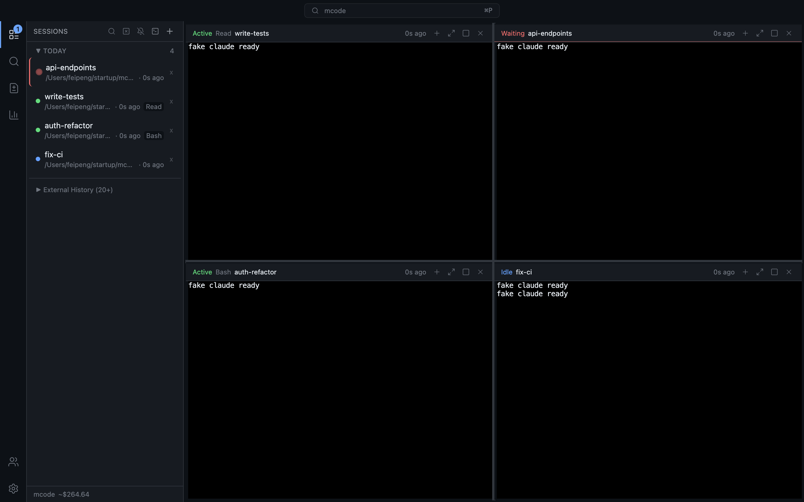
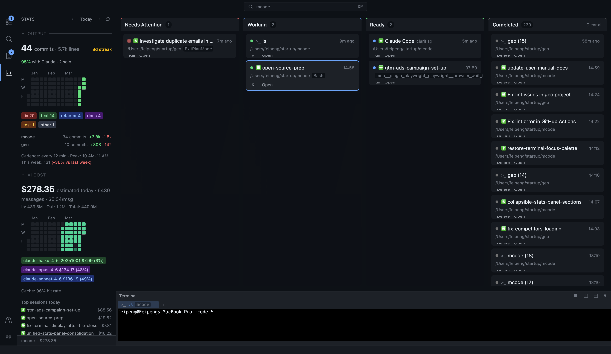
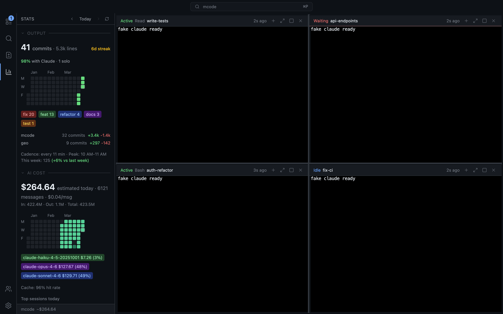

# mcode

**Terminal-native tiling IDE for parallel coding-agent sessions**

[](LICENSE)
[](https://github.com/roman10/mcode/actions)

mcode is a desktop IDE that lets you run, view, and orchestrate multiple coding-agent sessions simultaneously. It currently supports Claude Code, Gemini CLI, Codex CLI, Copilot CLI, and plain terminal sessions. Instead of tabbing between terminals, you see every session at once in a tiling layout — or switch to a kanban board grouped by status. A built-in task queue, hook-driven monitoring for Claude sessions, and 135 MCP tools make it highly automatable.

Looking for setup and usage docs? Start with the [user manual](docs/user_manual/README.md) for guided walkthroughs, feature guides, and shortcut reference.



## Features

### Multi-session management

- **Tiling layout** — split the screen into resizable tiles, each running a fully interactive agent terminal. See all sessions at once.
- **Kanban board** — switch to a board view with columns by status: Needs Attention, Working, Ready, and Completed.
- **Profile-based multi-account support** — isolated workspaces with their own credentials for Claude, Codex, Gemini, and Copilot. Switch accounts when a rate limit hits and resume work from another profile.



### Real terminal

- **node-pty + xterm.js WebGL** — the same terminal stack used by VS Code and Cursor. Full ANSI support, not a chat wrapper.
- **PTY persistence** — sessions survive app restarts via a background PTY broker process.

### Orchestration

- **Task queue** — dispatch prompts to sessions with per-session reordering, retry logic, and concurrent execution. Supports **plan mode** — agents propose a plan before executing, with an approve/revise workflow.
- **Hook-driven monitoring for Claude** — receives Claude Code hook events (tool use, notifications, permission requests, stops) over HTTP for live session visibility.
- **135 MCP tools** — 17 tool categories covering sessions, terminals, layout, tasks, git, files, commits, tokens, hooks, todos, prompt history, and more. Every feature is agent-accessible.

### Productivity

- **Command palette** (<kbd>Cmd+Shift+P</kbd>) + **Quick Open** (<kbd>Cmd+P</kbd>) — VS Code-style fuzzy navigation.
- **Prompt library** — unified palette (`@` prefix, <kbd>Cmd+Shift+S</kbd>) combining reusable snippet templates and prompt history with pinning and save-as-snippet.
- **Commit analytics** — daily bar charts, streaks, heatmaps, cadence, 7d/30d averages, and per-repo breakdown.
- **Token analytics** — usage and cost by model, cache efficiency, top sessions, 7-day heatmap.
- **Git integration** — commit graph visualization, VS Code-style staging/unstaging, and inline diff viewer.
- **Todos panel** — per-repo task list with priority levels, completion tracking, and automatic scanning of `TODO`/`FIXME`/`HACK`/`BUG` comments in code.



## Download

Pre-built DMG for Apple Silicon (macOS):

**[Download latest DMG (Apple Silicon)](https://github.com/roman10/mcode/releases/latest)**

The app is signed and notarized — macOS Gatekeeper will allow it to open without extra steps.

### Install via Homebrew

```sh
brew install --cask roman10/tap/mcode
```

## Installation

### Prerequisites

- **macOS** (primary platform)
- **Node.js** 22 or later
- **Agent CLIs** installed and authenticated only for the session types you want to run:
  - **Claude Code CLI** for Claude sessions (`npm install -g @anthropic-ai/claude-code`)
  - **Gemini CLI** for Gemini sessions (`npm install -g @google/gemini-cli`)
  - **Codex CLI** for Codex sessions
  - **Copilot CLI** for Copilot sessions
- **No agent CLI required** for plain terminal sessions

### Build from source

```bash
git clone https://github.com/roman10/mcode.git
cd mcode
npm install
npm run dev
```

### Build production DMG

```bash
npm run build:mac
```

This produces a DMG in the `dist/` directory.

## Quick Start

1. **Create a session** — press <kbd>Cmd+N</kbd> to create a new Claude Code session (pick a working directory and optional prompt), or choose Gemini CLI, Codex CLI, or Copilot CLI from the command palette. Use <kbd>Cmd+T</kbd> for a plain terminal.
2. **Split the view** — <kbd>Cmd+D</kbd> splits horizontally, <kbd>Cmd+Shift+D</kbd> splits vertically. <kbd>Cmd+Enter</kbd> maximizes a tile.
3. **Navigate** — <kbd>Cmd+Shift+P</kbd> opens the command palette. <kbd>Cmd+P</kbd> opens Quick Open for file search.
4. **Queue work** — <kbd>Cmd+Shift+T</kbd> creates a task. Tasks dispatch to sessions automatically or can target a specific session.
5. **Switch views** — <kbd>Cmd+Shift+L</kbd> toggles between tiling layout and kanban board.

For the full first-run walkthrough, see [Getting Started](docs/user_manual/getting-started.md).

## Documentation

- [User Manual](docs/user_manual/README.md) — start here for setup and feature guides
- [Getting Started](docs/user_manual/getting-started.md) — first-run walkthrough and core workflows
- [Attention & Tasks](docs/user_manual/attention-and-tasks.md) — understand attention levels and the task queue
- [Command Palette & Quick Open](docs/user_manual/command-palette.md) — fuzzy navigation, commands, and snippets
- [Sidebar Panels](docs/user_manual/sidebar-panels.md) — sessions, search, changes, stats, activity, and todos
- [Kanban View](docs/user_manual/kanban-view.md) — board layout, cards, and expanded session view
- [Terminal Panel](docs/user_manual/terminal-panel.md) — bottom terminal area, tabs, and layout
- [File Viewer](docs/user_manual/file-viewer.md) — opening, editing, and saving files
- [Git Changes & Diff Viewer](docs/user_manual/git-changes.md) — review, stage, and inspect changes
- [Profiles](docs/user_manual/accounts.md) — manage isolated profiles for Claude, Codex, Gemini, and Copilot
- [Multi-Account GitHub](docs/user_manual/multi-account-github.md) — GitHub SSH and gh CLI for multiple accounts
- [Settings](docs/user_manual/settings.md) — general, tracking, editor, and advanced settings
- [Keyboard Shortcuts](docs/user_manual/keyboard-shortcuts.md) — full shortcut reference

## Keyboard Shortcuts

| Shortcut | Action |
|---|---|
| <kbd>Cmd+N</kbd> | New session |
| <kbd>Cmd+T</kbd> | New terminal |
| <kbd>Cmd+D</kbd> | Split horizontal |
| <kbd>Cmd+Shift+D</kbd> | Split vertical |
| <kbd>Cmd+Enter</kbd> | Toggle maximize |
| <kbd>Cmd+W</kbd> | Close tile |
| <kbd>Cmd+Shift+P</kbd> | Command palette |
| <kbd>Cmd+P</kbd> | Quick Open |
| <kbd>Cmd+Shift+T</kbd> | New task |
| <kbd>Cmd+Shift+L</kbd> | Toggle tiling / kanban |
| <kbd>Cmd+\\</kbd> | Toggle sidebar |
| <kbd>Cmd+,</kbd> | Settings |

See [Keyboard Shortcuts](docs/user_manual/keyboard-shortcuts.md) for the full list, or browse the [User Manual](docs/user_manual/README.md) for feature guides.

## MCP Automation

mcode exposes a Model Context Protocol (MCP) server with 135 tools spanning the IDE's full surface:

| Category | Tools | Examples |
|---|---|---|
| Session | 20 | create, kill, resume, wait for status, set label/model, auto-close, account list |
| Layout | 17 | get/set view mode, add/remove tiles, maximize, toggle command palette/shortcuts |
| Terminal | 14 | send keys, read buffer, resize, drop files, panel height/tabs |
| Git | 10 | stage/unstage/discard files, get diff, open diff viewer |
| Commits | 9 | daily stats, heatmap, cadence, streaks, scan control |
| Hooks | 9 | list events, attention summary, wait/clear attention |
| Sidebar | 7 | switch tab, select session, get/set filter |
| Tokens | 7 | daily usage, model breakdown, session usage, context, heatmap |
| App | 6 | version, console logs, HMR events, sleep control, memory snapshot |
| Task | 6 | create, update, cancel, reorder, wait for status |
| File | 5 | list, read, write, open viewer, toggle Quick Open |
| Todo | 5 | create, update, delete, reorder, list |
| Prompt History | 4 | recent, search, pin/unpin, list pinned |
| Kanban | 3 | get columns, expand session, collapse |
| Window | 3 | get bounds, resize, screenshot |
| Snippet | 2 | list snippet templates, create from text |
| Search | 1 | full-text file search |
| Shell History | 1 | recent commands from `$HISTFILE` |
| Test / diagnostics | 6 | reset state, simulate wake, inject hook event, execute JS in window |

This means agents can drive the IDE programmatically — creating sessions, dispatching tasks, reading terminal output, and verifying results without manual interaction.

> **Note:** Copilot CLI sessions are excluded from token cost metrics — Copilot does not expose token usage data.

## Tech Stack

| Component | Technology |
|---|---|
| App shell | Electron 41 + electron-vite |
| Frontend | React 19 + TypeScript 5.9 |
| Terminal | node-pty + xterm.js (WebGL) |
| Tiling layout | react-mosaic-component |
| State | Zustand |
| Database | better-sqlite3 (SQLite, WAL mode) |
| Styling | Tailwind CSS v4 |
| Packaging | electron-builder |

## Contributing

See [CONTRIBUTING.md](CONTRIBUTING.md) for development setup, code conventions, and how to submit changes.

To run tests:

```bash
npm test              # unit tests
npm run dev           # start dev server (required for integration tests)
npm run test:mcp      # integration tests (in a separate terminal)
```

## License

[Apache 2.0](LICENSE)
